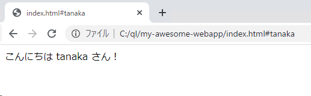
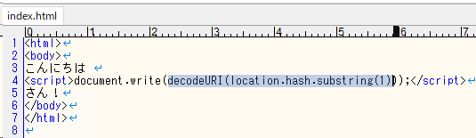
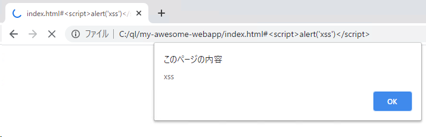

CodeQL javascript クロスサイトスクリプティング SAST

# CodeQLをローカルPCで実行する。ついでにクロスサイトスクリプティングの脆弱性を発見する。

やること

1. CodeQL CLI をインストール
2. starter pack をダウンロード
3. 検査対象のプロジェクト（ソースコード）を用意
4. CodeQL データベースを作成する
5. QLクエリを実行して欠陥を発見する

Windows + Powershell の実行例を書いてるけど、他の環境でも同じようにできるはず。たぶん。

## CodeQLI CLI をインストール

[GutHub: CodeQL の Release ページ](https://github.com/github/codeql-cli-binaries/releases)から自分の環境にあったZIPファイルをダウンロードします。

ZIPファイルを好きな場所に展開してください。

以下、`C:\ql\codeql` に展開した前提でコマンドを打っていきます。

```powershell
PS C:\ql\codeql> ls
    ディレクトリ: C:\ql\codeql
Mode                 LastWriteTime         Length Name
----                 -------------         ------ ----
d-----        2020/09/09      4:41                cpp
d-----        2020/09/09      4:41                csharp
d-----        2020/09/09      4:41                go
d-----        2020/09/09      4:41                java
d-----        2020/09/09      4:27                javascript
d-----        2020/09/09      4:26                legacy-upgrades
d-----        2020/09/09      4:26                Open-Source-Notices
d-----        2020/09/09      4:27                python
d-----        2020/09/09      4:41                tools
d-----        2020/09/09      4:27                xml
------        2020/09/09      3:55             97 .codeqlmanifest.json
------        2020/09/09      3:55           2987 codeql
------        2020/09/09      3:55            141 codeql.cmd
------        2020/09/09      4:10         181248 codeql.exe
------        2020/09/09      3:57           7563 LICENSE.md
```

`codeql.exe` がCLI本体なので、PATHを通しておくと便利。

```powershell
setx PATH "$env:path;C:\ql\codeql"
```

環境変数を設定したら powershell を再起動しておきましょう。(再起動なしでどうやってリロードするの？誰か教えて！)

`codeql` コマンドを叩いて、下記のような出力がでればCLIの準備はOK。

```powershell
PS C:\ql> codeql
Usage: codeql <command> <argument>...
Create and query CodeQL databases, or work with the QL language.

...
```

## starter をダウンロード

QLをイチから書くのはつらいので [vscode-codeql-starter](https://github.com/github/vscode-codeql-starter) をダウンロードして利用すると良いです。

```
git clone --recursive https://github.com/github/vscode-codeql-starter.git
```

このリポジトリには実用的なサンプルQLがいっぱいあります。例えば、javascript の XSS の可能性があるコードを検出する ql は、
`vscode-codeql-starter/ql/javascript/ql/src/Security/CWE-079` にある、など。

```
PS C:\ql\vscode-codeql-starter\ql\javascript\ql\src\Security\CWE-079> ls
    ディレクトリ: C:\ql\vscode-codeql-starter\ql\javascript\ql\src\Security\CWE-079
Mode                 LastWriteTime         Length Name
----                 -------------         ------ ----
d-----        2020/09/17     19:55                examples
-a----        2020/09/17     19:55           1492 ExceptionXss.qhelp
-a----        2020/09/17     19:55            731 ExceptionXss.ql
-a----        2020/09/17     19:55           1501 ReflectedXss.qhelp
-a----        2020/09/17     19:55            703 ReflectedXss.ql
-a----        2020/09/17     19:55           1576 StoredXss.qhelp
-a----        2020/09/17     19:55            691 StoredXss.ql
-a----        2020/09/17     19:55           2773 UnsafeJQueryPlugin.qhelp
-a----        2020/09/17     19:55            904 UnsafeJQueryPlugin.ql
-a----        2020/09/17     19:55           1576 Xss.qhelp
-a----        2020/09/17     19:55            713 Xss.ql
-a----        2020/09/17     19:55           2537 XssThroughDom.qhelp
-a----        2020/09/17     19:55            708 XssThroughDom.ql
```

※ちなみに `CWE-079` は `Improper Neutralization of Input During Web Page Generation ('Cross-site Scripting')`

## 検査対象のプロジェクト（ソースコード）を用意

分析したいリポジトリを git clone すればいいです。

今回は特別にWebアプリケーションを作ったので、これをCodeQLで分析してみましょう。

```html: C:\ql\my-awesome-webapp\index.html
<html>
<body>
こんにちは 
<script>document.write(decodeURI(location.hash.substring(1)));</script>
さん！
</body>
</html>
```

URLの#以降に名前を入れると挨拶してくれます。こんにちは！



## CodeQL データベースを作成する

CodeQLはソースコードを直接分析するわけではなく、ソースコードをもとにデータベースを作り、そのデータベースにクエリを実行して分析します。

さきほどのWebアプリケーションは `C:\ql\my-awesome-webapp` に置きました。次のコマンドでWebアプリのjavascriptを分析するためのデータベースを `C:\ql\my-awesome-webapp-qldb` に作成します。
```
PS C:\ql> cd .\my-awesome-webapp\
PS C:\ql\my-awesome-webapp> codeql database create ../my-awesome-webapp-qldb --language=javascript

...いっぱい...

[2020-09-17 20:28:39] [build] Done extracting C:\ql\codeql\javascript\tools\data\externs\web\window.js (15 ms)
Finalizing database at C:\ql\my-awesome-webapp-qldb.
Successfully created database at C:\ql\my-awesome-webapp-qldb.
```

コマンドの詳細は⇒[Creating CodeQL databases: Creating CodeQL databases](https://help.semmle.com/codeql/codeql-cli/procedures/create-codeql-database.html#running-codeql-database-create)


## QLクエリを実行して欠陥を発見する

作成したデータベースにクエリを実行します。

実行方法：

```powershell
codeql database analyze {データベース名} `
{クエリ} `
--format {出力フォーマット} `
--output {出力ファイル名} `
```

下記は `vscode-codeql-starter\ql\javascript\ql\src\Security\CWE-079\Xss.ql` クエリを実行し、結果を `test.csv` 出力する実行例です。

```powershell
codeql database analyze "my-awesome-webapp-qldb" `
vscode-codeql-starter\ql\javascript\ql\src\Security\CWE-079\Xss.ql `
--format csv `
--output test.csv `
--threads 0
```

初回実行時は驚くほど時間がかかります（1分くらいかかった）が、2回目以降は早いです。`--threads 0` オプションを付けると CPU コアコアをいい感じに使ってくれます。詳しくは⇒[Client-side cross-site scripting](https://help.semmle.com/codeql/codeql-cli/procedures/analyze-codeql-database.html#analyzing-databases-with-the-codeql-cli)

クエリにはディレクトリを指定することもできます。この場合、ディレクトリ以下のクエリすべてが実行されます。セキュリティ関連は`Security`ディレクトリにまとまってるので SAST として使うことができます！クエリが多いのでとっても時間がかかります。

```powershell
PS C:\ql> codeql database analyze "my-awesome-webapp-qldb" `
>> vscode-codeql-starter\ql\javascript\ql\src\Security\ `
>> --format csv `
>> --output test2.csv `
>> --threads 0
```

100万年待ってもクエリが完了しないので、最初に実行したクエリの結果 `test.csv` を見てみます。

```powershell
PS C:\ql> cat .\test.csv
"Client-side cross-site scripting","Writing user input directly to the DOM allows for a cross-site scripting vulnerability.","error","Cross-site scripting vulnerability due to [[""user-provided value""|""relative:///index.html:4:34:4:41""]].","/index.html","4","24","4","60"
```

Client-side cross-site scripting：ユーザが入力した値を直接DOMに書いたらクロスサイトスクリプティングできちゃうぞ！らしいです。

CSVの最後のカラム `"/index.html","4","24","4","60"` はソースコードの該当箇所です。index.html の4行目24文字目～4行目60文字目 がクソコードと指摘しています。



確認したところ、指摘通りクロスサイトスクリプティング攻撃が可能でした。リリースする前に気づけて良かった！



おわり。